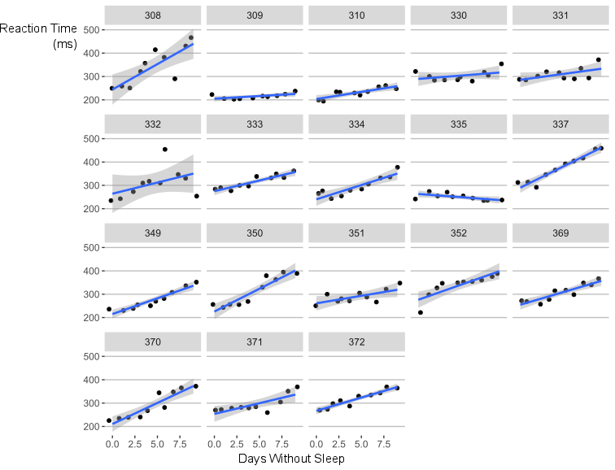

<style type='text/css'>
img {
    max-height: 560px;
    max-width: 964px;
}
</style>

## When do Biased Models Beat Unbiased?

>* Always
>* ish...

--- .class #id 

## What does 'Beat' mean here?

>* more accurate out of sample prediction.
>* fairly uncontroversial measure of performance.

---

## What does Bias mean in this context?

$$\operatorname{Bias}_\theta[\,\hat\theta\,] = \operatorname{E}_\theta[\,\hat{\theta}\,]-\theta$$

>* Technical statistical definition.
>* *Not* the colloquial definition.
>* Fairly abstract, but underlies a lot of commonly used estimates/models
>* Sample mean, Sample Median, (generalised) linear regression, ANOVA, and more hinge on un-biased estimates.

---

## Why would we bias our estimates?

>* Generally to help deal with excess variance in our estimates.
>* Why not...

--- 

## Regularisation

>* Very large number of predictor variables can cause difficulties.
>* Multiple Comparisons risk unreliable hypothesis tests
>* Complete failure in P > N cases
>* Often increases the risks of co-linearity

--- 

## Regularisation

* Regularisation simply involves adding some penalty on model complexity.
* This can be achieved in various ways, below is an example of the function used to fit a LASSO regression. An upper limit is set on all regression coeficients, limiting complexity.

$$\min_{ \beta_0, \beta } \left\{ \frac{1}{N} \sum_{i=1}^N (y_i - \beta_0 - x_i^T \beta)^2 \right\} \text{ subject to } \sum_{j=1}^p |\beta_j| \leq t.$$

* This shrinks (biases) estimates towards zero, how much bias is introduced is decided using cross-validation.

---

## Regularisation

* What's this look like?

```{R echo=FALSE, results='hide', message=FALSE, warning=FALSE}
## code for producing ridge and LASSO trace plots for paper

# load libraries and dataset
library(glmnet)
library(ggplot2)
library(dplyr)
library(ggthemes)
library(gridExtra)
library(broom)
data(QuickStartExample)

```

```{R echo=FALSE, warning=FALSE, fig.align = 'centre'}
#### LASSO Estimate ####
lasso_fit <- glmnet(x, y)
tidied_lasso <- tidy(lasso_fit) %>% filter(term != "(Intercept)")

lasso_gg <- ggplot(tidied_lasso, aes(x = lambda, y = estimate, group = term)) + 
  geom_path(alpha = .4) +
  theme_hc() +
  ggtitle("LASSO Trace") +
  scale_y_continuous(breaks = c(-1, -.5, 0, .5, 1, 1.5), limits = c(-1.2, 1.5))
  

#### ridge regression example ####
ridge_fit <- glmnet(x, y, alpha = 0)
tidied_ridge <- tidy(ridge_fit) %>% filter(term != "(Intercept)")

ridge_gg <- ggplot(tidied_ridge, aes(x = lambda, y = estimate, group = term)) + 
  geom_path(alpha = .4) +
  theme_hc() +
  xlim(0,30) +
  ggtitle("Ridge Regression Trace") +
  scale_y_continuous(breaks = c(-1, -.5, 0, .5, 1, 1.5), limits = c(-1.2, 1.5))

#### join in grid ####

grid.arrange(ridge_gg, lasso_gg, ncol = 2)

```


---

## Regularisation is very useful
>* Efficient variable selection in high dimensions
>* Enables treatment of poorly posed problems
>* As a general rule, provides better fit

---

## When to use regularisation?

>* When there are a large number of predictor variables to be modelled.
>* When the problem is poorly posed; due to multicolinearity, more variables than observations, hard to interpret output, etc.

---

## Hierarchical Modelling


---

## Hierarchical Modelling



---

## Hierarchical Modelling

>* Halfway between complete pooling and no-pooling.
>* Weighted average between the two.
>* Results in biased, ‘half-way’ estimates.
>* Typically provides better prediction of future data than unbiased estimates.

---

## Hierarchical Modelling


---

## When to use Hierarchical Modelling

>* When there are a number of groups you wish to measure the same property over, but you've a limited sample size.
>* Particularly when groups are very smallin size.
>* When you have multi-levelled data, e.g. pupils, within classes, within schools, within counties, within...

---


---

## How to use regularisation and hierarchical modelling

>* lots of software now includes these tools.
>* SPSS, SAS, STATA, Pyton.
>* Personally recommend R.


